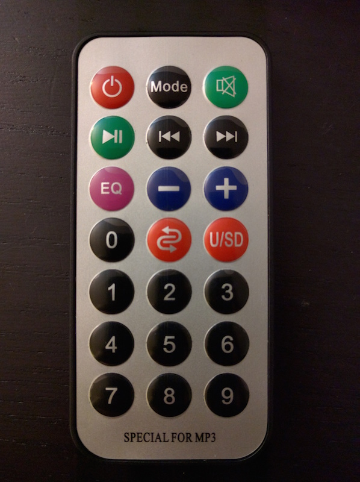

# Arduino "SPECIAL FOR MP3" Remote Receiver Template Project
Template code for using an IR Receiver on Arduino with a remote control that reads "SPECIAL FOR MP3"

## Installation
* Remove the "RobotIRRemote" from the default libraries of your Arduino installation.
  * On OSX, right-click on the Arduino application -> Show Package Contents -> Contents -> Java -> libraries. 
    Remove from this folder.
  * On Windows, not sure where to find it, but it should be a similar process of removing the correct folder.
    Send me a pull request with better instructions!
  * Note: We need to do this step because that library conflicts with a dependency of this project. 
    This is a bug that the maintainers of Arduino are aware of. See the 
    [pull request](https://github.com/arduino/Arduino/issues/4040) for the current status of whether or not 
    this has been fixed.
* Install the [external IR library](https://github.com/z3t0/Arduino-IRremote) to handle the IR de-encoding.
  * If you don't want to read the docs and want to skip straight to the install, here's the 
    [latest stable release](https://github.com/z3t0/Arduino-IRremote/releases/tag/stable).

## Try it out
Check if everything is set up correctly by doing the following:
* Plug your IR sesnor into your arduino. (Your mileage may vary: my IR sensor's wires are 
  `VOUT`, `GND`, `VCC` from left to right with the sensor facing me and above the wires.)
  * Plug the `VOUT` of your IR sensor into the `RECV_PIN` (code defaults to pin 11) of your Arduino.
  * Plug `GND` of the sensor into the `GND` of your Arduino.
  * Plug the `VCC` of the sensor into the `5V` of your Arduino.
* Upload the program to your Arduino.
* Open the Serial Monitor.
* Press/hold buttons on your remote. You should see corresponding output in the monitor.

## Customize!
Now that you've got it working, you can add your own code into the `*_button` functions to make things
happen when you press or hold certain buttons on your remote. All of the functions pass a `button_held`
parameter which is `false` for the inital button press and `true` for button holds.
